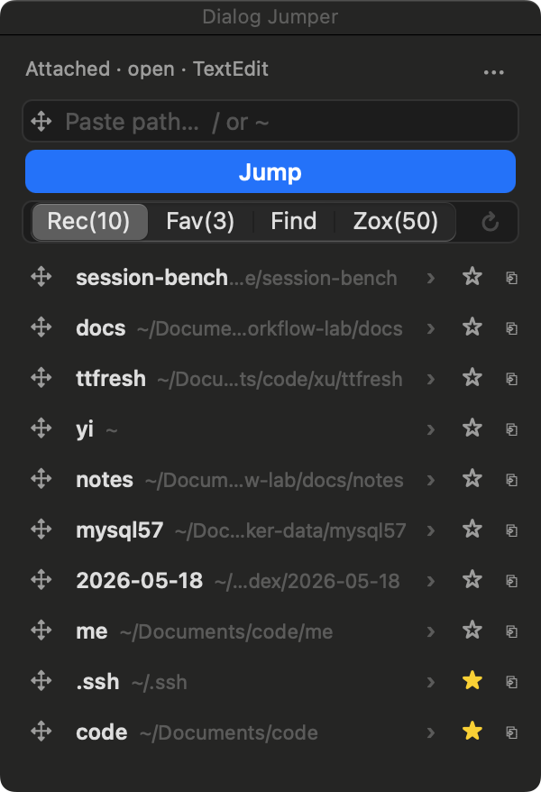

# Dialog Jumper

macOS menu bar tool for **Folder Jump** inside **system Open / Save dialogs**. It never clicks Open/Save for you.

A side chrome attaches next to the file dialog with Path input, Recents, Favorites, open **Finder** windows, and **zoxide** frecency paths.

> Lab / personal-use stage. Spec (Chinese research notes):  
> [`.scratch/macos-file-dialog-jumper/assets/mvp-spec.md`](.scratch/macos-file-dialog-jumper/assets/mvp-spec.md)

**中文说明：** [README.zh-CN.md](./README.zh-CN.md)

## Screenshot



Side panel next to a system Open dialog: Path, Jump, Rec / Fav / Find / Zox, list actions (drag · favorite · copy).

### Quick start
1. Enable **Accessibility** for Dialog Jumper.  
2. Open a system file dialog (e.g. TextEdit → **File → Open…**).  
3. Use **Path + Jump**, a list row, or **drag the handle** onto the dialog (native navigation).  
4. Dialog Jumper **never** presses Open/Save for you.  
5. Unsigned builds: right-click → Open, or `xattr -cr DialogJumper.app`.

---

## Features

### Core Jump
- Detects standard panels via **Open and Save Panel Service** (visible large window + AX fingerprint)
- Side chrome **Path** field (`/` or `~`) → **Jump**
- Jump sequence: `⇧⌘G` → path field → directed click → Return  
- **Never** auto-clicks Open / Save
- Bad path / no panel: visible failure, retry OK

### Side list (Rec | Fav | Find | Zox)

| Tab | Source | Refresh |
| --- | --- | --- |
| **Rec** | Folders successfully jumped in this app (max 10) | Auto |
| **Fav** | User pins, explicit order (max 40) | Auto |
| **Find** | Paths of open Finder windows (max 50) | **↻** (needs Automation) |
| **Zox** | `zoxide query -l` frecency (max 50) | **↻** (needs [zoxide](https://github.com/ajeetdsouza/zoxide)) |

- **Single-click:** fill Path; whether it also Jumps is controlled by menu **Jump on List Click** (default on)
- **Double-click:** always Jump
- **Left drag handle:** drag a folder file URL onto the Open/Save panel for **native navigation** (separate from Jump click)
- **★** Favorite · **⎘** copy full path  
- Favorites rows: **↑ ↓ ✕**

### Menu bar
- **DJ** / **DJ!** / **DJ●** (fixed width, no jitter)
- Accessibility · Folder Jump · Last jump
- Focus Path · **Jump on List Click** · Recheck · Open Settings · Relaunch · About · Quit

### Permissions
- **Accessibility** required for Jump; revoke dismisses chrome and pauses Jump
- **Automation (Finder)** only for Find tab refresh
- Soft failures → status line; no prompt storms

### Out of scope (for now)
- Global hotkeys (use system **⇧⌘G** for Go to Folder)
- Fuzzy on-device folder search / cloud index
- Submitting Open/Save for the user; syncing Finder sidebar favorites

---

## Run (development)

```bash
cd apps/DialogJumper
./scripts/run-dev-app.sh
```

1. System Settings → Privacy & Security → **Accessibility** → enable Dialog Jumper  
2. TextEdit → **File → Open…**  
3. Menu bar shows **DJ●** and the side chrome appears  

Dev signing uses a local identity (**DialogJumper Dev**). Do **not** enable Hardened Runtime (breaks cross-process AX).

```bash
cd apps/DialogJumper && swift test && swift build
```

---

## Install from GitHub Release (no Developer ID)

Releases are **ad-hoc signed and not notarized**. Expect Gatekeeper friction.

1. Download the macOS zip from [Releases](../../releases)
2. Unzip, then either right-click **DialogJumper.app** → Open, or `xattr -cr DialogJumper.app`
3. Enable **Accessibility**
4. Optional: **Automation** → Dialog Jumper controlling **Finder** (Find tab)
5. Optional: install **zoxide** (Zox tab)

---

## Publish (GitHub Actions)

Push a version tag:

```bash
git tag v0.1.0
git push origin v0.1.0
```

Or run the **Release** workflow manually (`workflow_dispatch` → draft release).

Local package:

```bash
apps/DialogJumper/scripts/package-release.sh
# → apps/DialogJumper/dist/DialogJumper-*-macos-*.zip
```

---

## Layout

| Path | Contents |
| --- | --- |
| `apps/DialogJumper/` | SwiftPM app + scripts |
| `docs/` | progress / constraints / journal |
| `.scratch/` | research / MVP tickets (optional local) |

License: [MIT](./LICENSE)

---

## Requirements

| Need | For |
| --- | --- |
| macOS 14+ | App |
| Accessibility | Jump |
| Finder Automation | Find tab |
| [zoxide](https://github.com/ajeetdsouza/zoxide) | Zox tab |
